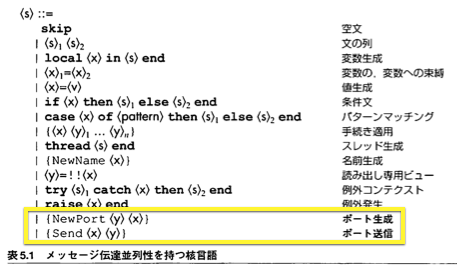
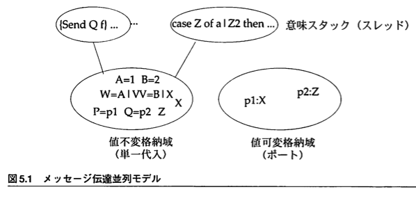
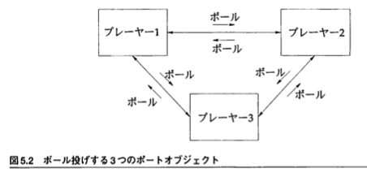
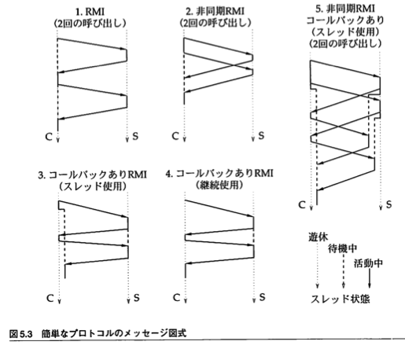

class: center, middle

# CTMCP読書会@mixi

2015/03/17

5章1節 - 5章3節 (p.357 - p.377)

[index](http://memerelics.github.io/ctmcp/)

[5章ソースコード@GitHub](https://github.com/memerelics/ctmcp/tree/master/sec5)

---

## Index - 5章 メッセージ伝達並列性

* 5.1 メッセージ伝達並列モデル
    * 5.1.1 ポート
    * 5.1.2 ポートの意味
* 5.2 ポートオブジェクト
    * 5.2.1 NewPortObject抽象
    * 5.2.2 例
    * 5.2.3 ポートオブジェクトに関する推論
* 5.3 簡単なメッセージプロトコル
    * 5.3.1 RMI(遠隔メソッド起動)
    * 5.3.2 非同期RMI
    * 5.3.3 コールバックのあるRMI(スレッド使用)
    * 5.3.4 コールバックのあるRMI(継続のためのレコード使用)
    * 5.3.5 コールバックのあるRMI(継続のための手続き使用)
    * 5.3.6 エラー報告
    * 5.3.7 コールバックのある非同期RMI
    * 5.3.8 二重コールバック

---

class: center, middle

# 5章 メッセージ伝達並列性

Message-Passing Concurrency

---

## メッセージ伝達

メッセージ伝達はひとつのプログラミングスタイル

* プログラムは独立した実体の集まり
* 実体はメッセージを非同期的(応答を待たない)に送受信しあう

メッセージ伝達が重要になる分野

* マルチエージェントシステム
* 分散システム
* 高度に信頼性のあるシステム

---

## 宣言的並列モデル(4章)を拡張する

前章までの宣言的並列モデルは観測可能な非決定性を持つことが出来なかった．これに

「非同期通信チャンネル」 asynchronous communication channel

というただひとつの新しい概念を追加する．

---

## 宣言的並列モデル(4章)を拡張する

任意のクライアントが任意のタイミングでチャンネルにメッセージを送り，サーバはチャンネルからすべてのメッセージを読むことができる

クライアントの送信順序は非決定的なので，実行順序によって異なる結果を返す．

メッセージ伝達モデルは非決定的であり，もはや宣言的ではない．

---

## ポート

* ストリームが付属する簡単なチャンネル．
* ポートにメッセージを送信すると，メッセージがポートのストリームに現れる．
* ポートオブジェクト: ポートにストリームオブジェクトを紐付けたもの
* ポートオブジェクトは宣言的な再帰的手続きによって定義されるため，ポートオブジェクトにおいては，宣言的モデルの特徴が保たれる．

---

class: center, middle

## 5.1 メッセージ伝達並列モデル

---

## 5.1 メッセージ伝達並列モデル



---

## 5.1.1 ポート

ポートは安全なADT(Abstract Data Type)で，ふたつの操作を持つ．(※"安全"についてはp.211参照)

* `{NewPort ?S ?P}` : 入り口P，ストリームSを持つ新しいポートを生成
* `{Send P X}` : 入り口Pに紐付いたストリームにXを載せる

ポートは非同期FIFO通信チャンネル．これらの操作はOzに定義済なので使ってみる．

```
declare S P in
{NewPort S P}
{Browse S}
{Send P a}
{Send P b}
```

ストリーム `a|b|_` を表示する．

---

## 5.1.2 ポートの意味



ポートの定義に必要なので，単一代入格納域とは別に，値可変格納域(mutable store)を追加する

* 単一代入格納域(`σ`)
* トリガ格納域(`τ`) (任意．遅延性が欲しい場合は必要)
* 値可変格納域(`μ`)

---

## 5.1.2 ポートの意味


ポートは`x:y`という対．x, yはそれぞれ単一代入格納域の変数．
xはポートを表す名前値(name value)に束縛されており，
yは束縛されていない

実行状態は `(MST, σ, μ)` (遅延性を含める場合は `(MST, σ, μ, τ)`)．※この後の抽象マシン状態は遅延性なしで書かれている

---

## 5.1.2 ポートの意味

### NewPort操作

意味言明 `({NewPort <x> <y>}, E)` は次のことを行う

* 名前nの新しいポートを作成
* `E(<y>)`とnをその格納域の中で束縛(これは単一代入値格納域の束縛)
* 束縛に成功すれば，値可変格納域`μ`に対 `E(<y>):(E(<x>))` を追加する．xはストリーム．
* 束縛に失敗したらエラー状況を発生させる

---

## 5.1.2 ポートの意味

### Send操作

意味言明 `({Send <x> <y>}, E)` は次のことを行う

* A. 活性化条件が偽(= `E(<x>)`が非決定状態)である場合
    * 実行待機
* B. 活性化条件が真(= `E(<x>)`が決定状態)である場合
    * B1. `E(<x>)`がポートの名前に束縛されていない
        * エラー
    * B2. `E(<x>)`がポートの名前に束縛されている
        * 単一代入格納域に新しい変数z'を生成
        * 値可変格納域を`E(<x>):z'`に更新(「値が可変」なのでこれが可能)
        * 新しいリスト対`E(<y>)|z'`を生成して，単一代入格納域でそれをzに束縛する．

---

## 5.1.2 ポートの意味

### メモリ管理

* 到達可能性の定義の変更
    * 値可変格納域に`x:y`があり，xが到達可能ならyも到達可能とする
* ポートの再利用
    * 変数xが到達不能になり，かつ値可変格納域に対`x:y`が含まれていれば，その対を削除する．

---

class: center, middle

## 5.2 ポートオブジェクト

---

## 5.2 ポートオブジェクト

拡張されたストリームオブジェクト

* 拡張(1): 多対一の通信を可能にしていること
* 拡張(2): データ構造(メッセージ含む)の中に埋め込むことが出来る

---

## 5.2 ポートオブジェクト

ポートオブジェクトの変種

* エージェント(agent)
    * メッセージ交換ができるアクティブな実体
* プロセス(process)
    * 入ってくるメッセージをパターンマッチングでフィルタリング
* 能動的オブジェクト(active object)
    * オブジェクト指向的にクラスによって定義されている
    * 詳しくは7章

---

## 5.2 ポートオブジェクト

メッセージ伝達モデルにおいて，プログラムは，メッセージを送受信するポートオブジェクトの集合である．

* ポートオブジェクトは新しいポートオブジェクトを生成できる
* ポートオブジェクトは他のポートオブジェクトへの参照を含むメッセージを送ることが出来る
* => つまり，実行中にポートオブジェクトの集合グラフが成長していく

---

## 5.2 ポートオブジェクト

ポートオブジェクトを使うコードを一般化して書くと

```
declare P1 P2 ... Pn in
local S1 S2 ... Sn in
    {NewPort S1 P1}
    {NewPort S1 P1}
    ...
    {NewPort S1 P1}
    thread {RP S1 S2 ... Sn} end
end
```

RPは再起的手続き．ポートストリームを読んで，受信メッセージに対して何らかの処理を行う．

---

## 5.2 ポートオブジェクト

実コード例

```
declare P in
local S in
    {NewPort S P}
    thread {ForAll S Browse} end
end
```

---

## 5.2 ポートオブジェクト

Browseは引数1個の手続きなのでforループを使ってこうも書ける

```
declare P in
local S in
    {NewPort S P}
    thread for M in S do {Browse M} end end
end
```

`{Send P hi}` などとポートにメッセージを送ればそれがBrowseで表示される．

ポートオブジェクトは，次のメッセージがどのスレッドから来るか知らない．対称的に，ストリームオブジェクトは次のメッセージの出元がわかっている．

---

## 5.2.1 NewPortObject抽象

ポートオブジェクトを簡単に使うような抽象，NewPortObject抽象を定義する．そのためには，初期状態Initと状態遷移関数Funを使う．

```
fun {NewPortObject Init Fun}
Sin Sout in
    thread {FoldL Sin Fun Init Sout} end
    {NewPort Sin}
end
```

※ Sin/Soutは標準入出力

---

## 5.2.1 NewPortObject抽象

内部状態を持たない，完全に反応的なポートオブジェクトであればもっと簡単に書ける．

```
fun {NewPortObject2 Proc}
Sin in
    thread for Msg in Sin do {Proc Msg} end end
    {NewPort Sin}
end
```

受けたメッセージに対してProcを作用させるだけ

---

## 5.2.2 例

3人のプレーヤーが輪になってボールを投げ合う．ボールを受け取ると他の2人からランダムに選んで投げる．



---

## 5.2.2 例

まずプレーヤーを作成．状態を持たずメッセージに反応するだけのver2を使う．

```
fun {Player Others}
   {NewPortObject2
    proc {$ Msg}
       case Msg of ball then
          Ran={OS.rand} mod {Width Others} + 1
       in
          {Send Others.Ran ball}
       end
   end}
end
```

ボールを受け取ったらランダムな相手に"ball"メッセージをSendする．

```
P1={Player others(P2 P3)}
P2={Player others(P1 P3)}
P3={Player others(P2 P2)}
```

ゲームを始める

```
{Send P1 ball}
```

---

## 5.2.3 ポートオブジェクトに関する推論

相互にメッセージを送信するポートオブジェクトが「正しいことの証明」はどうすればよいか．

1. 各ポートオブジェクトそのものが正しいこと
2. 全体が正しく協働すること

を証明する．

---

## 5.2.3 ポートオブジェクトに関する推論

### 1. 各ポートオブジェクトそのものが正しいこと

各ポートオブジェクトはひとつのデータ抽象を定義する．この抽象は不変表明(invariant assertion)をもたねばならない．

* 不変表明 = ある抽象操作の完了と次の操作の開始の間で真になる表明

表明が不変であることを示せば，抽象が正しいことが示される．ポートオブジェクト内部は宣言的，かつスレッドがひとつしかないことから操作が直列なので，第3章の宣言的モデルと同様に数学的帰納法で証明できる．

* ポートオブジェクトが初めて生成されたとき，表明が成り立つ
* メッセージを操作する前に表明が成り立っていれば，そのメッセージを操作した後でも表明が成り立つ．

---

## 5.2.3 ポートオブジェクトに関する推論

### 2. 全体が正しく協働すること

各プログラムが受診する可能性のあるメッセージ列を分類する必要がある．そのために，システム中のイベントを分類する．

* イベント(1): メッセージ送信
* イベント(2): メッセージ受信
* イベント(3): ポートオブジェクトの内部状態変更

そのあとイベント間の因果関係を決める．ポートオブジェクトを含むプログラム全体を状態遷移システムと考えて推論していけば良い，とのこと

---

class: middle, center

## 5.3 簡単なメッセージプロトコル

---

## 5.3 簡単なメッセージプロトコル

プロトコル = 2つ以上の関係者の間のメッセージの列で，単なる個々のメッセージ以上の抽象化レベルにあると了解されるもの．TCP/IP, HTTP, FTP, Ethernet, DHCPなど



---

## 5.3.1 RMI(遠隔メソッド起動)

RMI :  Remote Method Invocation

あるオブジェクトが別のオペレーティングシステムのプロセスの中にあるオブジェクトを呼べるようにするもの．歴史的にはRPC(Remote Procedure Call)の子孫で，呼び出される遠隔実体として手続きの代わりにオブジェクトが出てきた．

ここで「メソッド」は「ポートオブジェクトがメッセージを受信した時に行うこと」というだけの意味と考える．オブジェクト指向的な意味は7章．

% oz

---

## 5.3.1 RMI(遠隔メソッド起動)

Clientは"Server"を直接参照しているが，

```
proc {ClientProc Msg}
   case Msg
   of work(Y) then Y1 Y2 in
       {Send Server calc(10.0 Y1)}
       ...
   end
end
```

---

## 5.3.1 RMI(遠隔メソッド起動)

Server側はYを通じてClientを間接的に知るという非対称性がある．

```
proc {ServerProc Msg}
   case Msg
   of calc(X Y) then
      Y=X*X+2.0*X+2.0
   end
end
```

---

## 5.3.1 RMI(遠隔メソッド起動)

* 例ではすべてのメッセージがサーバによって直列に実行される．経験上，これが，RMIを実装する最善の方法である．プログラムしやすく，推論しやすい．

* 異なるクライアントからいくつも呼び出しが来て，それを複数スレッドで並列に実行する場合はより複雑で，直列に処理することができない．こういうサーバは8章で扱う．

* CやJavaのような，RMIやRPCを用意している言語では，サーバがメッセージを「直列に処理するかどうか」を知ることが重要

* 分散システムでのプログラミングは11章で扱う．

---

## 5.3.2 非同期RMI

クライアントは要求を送った直後から実行を続けることが出来る(サーバからの応答を待たない)．

非同期クライアントの例(サーバは同じでよい)

% oz

---

## 5.3.3 コールバックのあるRMI(スレッド使用)

"RMI with callback (using thread)"

% oz

---

## 5.3.4 コールバックのあるRMI(継続のためのレコード使用)

RMI with callback (using record continuation)

もしスレッドが安価でなければ別の方法を考える必要がある．たとえば

「クライアントがサーバに継続(continuation)を表すレコードを渡す」方法

サーバは仕事が終わればクライアントにそのレコード(cont)を戻す．

% oz

---

## 5.3.5 コールバックのあるRMI(継続のための手続き使用)

RMI with callback (using procedure continuation)

レコードの代わりに手続きを渡すことで，5.3.4の方法を強力に一般化するgeneralized in a powerful wayことができる．

* サーバ: そのまま
* クライアント: データフロー変数Zを介してデータをやりとりする代わりに，クライアントから送る時点で「戻ってきた時にやるべき仕事」を手続きにして渡す

% oz

---

## 5.3.6 エラー報告

サーバが例外を発生させ，それをクライアントに知らせられるようにする

% oz

※ 「サーバは例外を補足でき，それをクライアントに渡すことが出来る」という仮定を置いている．この仮定が成り立たない場合については11章で扱う．

---

## 5.3.7 コールバックのある非同期RMI

「プロトコルを組み合わせて洗練されたものにする」例．

2つの非同期RMIがあり，どちらもコールバックする．

% oz

---

## 5.3.8 二重コールバック

サーバがクライアントにコールバックして，それがサーバに再度コールバックする場合

% oz
